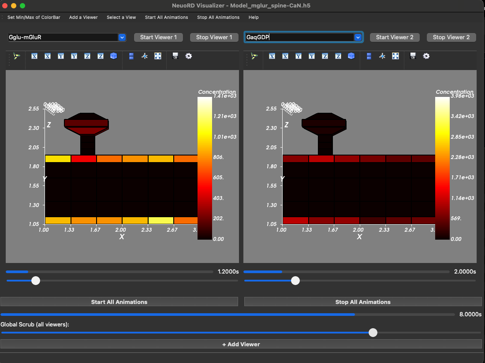

# NeuroRDViz
### Post-Synaptic Morphology and Particle Concentration Visualizer

3D visualization tool for NeuroRD simulation output. Renders voxel morphology as hexahedral meshes and animates molecule concentration data from HDF5 files.

## Setup

Requires a conda-forge environment (macOS ARM64 / Apple Silicon compatible):

```bash
conda create -n neurordviz --strict-channel-priority \
    -c conda-forge python=3.11 mayavi h5py pyside6
conda install -n neurordviz -c conda-forge "numpy<2"
conda activate neurordviz
```

## Usage

```bash
python NeuroRDViz.py <simulation_file.h5>
```

Example:

```bash
python NeuroRDViz.py Model_mglur_spine-CaN.h5
```

## Features

- **Multi-viewer**: Run independent molecule animations side-by-side (File > Add Viewer or the + button)
- **Per-viewer controls**: Each viewer has its own molecule dropdown, Start/Stop buttons, progress bar, and scrub slider
- **Global controls**: Start All / Stop All buttons and a global scrub slider to sync all viewers
- **Stable colorbar**: Concentration color range is locked to the global min/max across the full animation
- **Simulation time display**: Progress labels show actual simulation timepoints from HDF5 metadata

<table>
<tr>
<td></td>
<td></td>
</tr>
<tr>
<td align="center"><em>Single viewer</em></td>
<td align="center"><em>Multi-viewer with independent animations</em></td>
</tr>
</table>
